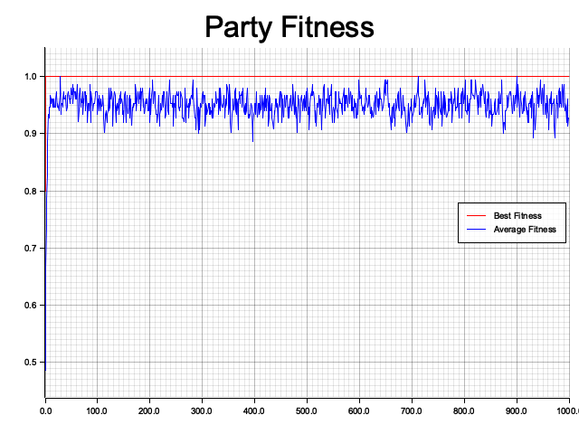

# Getting Started

Evolutionary is a fully extensible Rust framework for using paralyzed genetic algorithms to solve problems. 
By fully extensible, we mean that you can code your own `selection`, `crossover` or `mutation`, and even your 
own `individuals`. You just need to implement the traits and use them on the Evolution.

Here we will show you how to use the built-in implementation for the genetic operators and be able to solve a
simple problem.

### The Problem

You're throwing a party and want to maximize the fun. The more friends attend, the merrier the party, and as everyone
likes you, anyone invited will for sure come. However, there's a limit to how many guests you can invite. 
You have a list of friends, each marked as either 'invited' or 'not invited'. Your task is to adjust this list to 
maximize the overall enjoyment at the party, considering the guest limit and the dynamics between the attendees. 
You need to choose how many guests to invite to optimize the fun.

### Coding

We can use the Binary encoding for this problem, where each bit represents if a friend is invited (1) or not (0). This 
list will have the size of the limit of guests. For example, if the limit is 5, the list will have 5 bits. This way we
already have a way to meet the constraints.

### Objective Function

The objective function will be the sum of the bits of the list and we want to maximize it.

### Fitness Function

The fitness function will be the sum of the bits of the list. This way, the more friends we invite, the higher the fun.
Here we can already start to define our problem in the evolutionary framework:

```rust
use evolutionary::prelude::*;

// It needs to implement clone because it will be used in the EvolutionBuilder.
#[derive(Clone)]
struct PartyFitness;

impl Fitness<Bin> for PartyFitness {
    fn calculate_fitness(&self, individual: &Bin) -> f64 {
        let mut sum = 0.;

        for i in 0..individual.get_chromosome().len() {
            if individual.get_gene(i) {
                sum += 1.;
            }
        }

        sum
    }
}
```

The struct `PartyFitness` implements the trait `Fitness` for the type `Bin`. The `calculate_fitness` method receives an
individual and returns its fitness. Here we just count the number of bits set to 1.

### Evolution

We can already get into the evolution to solve our problem. To do this we can create a `EvolutionBuilder` and set all
the required parameters:

```rust
fn main() {
    let max_guests = 5;

    // Set an arbitrary number of individuals: 30
    // Set the size of the chromosome: max_guests to meet our constraints
    // And set this evolution to use the Binary encoding
    let mut evolution = EvolutionBuilder::new(30, max_guests, GeneCod::Bin, ())
        // Set the fitness function
        .with_fitness(PartyFitness)
        // Use the Tournament Selection
        .with_selection(TournamentSelection::default())
        // Use the Binary Crossover
        .with_crossover(NPointsCrossover::default())
        // Use the Binary Mutation with a mutation rate of 0.05 (which is the default)
        .with_mutation(BitSwapMutation { mutation_rate: 0.05 })
        // Set the stop condition based on the number of iterations
        .with_stop_condition(move |_, iterations, _| iterations >= 1000)
        .build().unwrap();

    // The run method of the Evolution will run the evolution until the stop condition is met
    evolution.run();

    // After the evolution is done, we can get the best individual and its fitness:
    let best = evolution.current_best();

    println!("Best individual: {:?}", best);
    println!("Best fitness: {}", evolution.current_best_fitness());
    

    evolution.plot_fitness();
}
```

In this example we used the `TournamentSelection`, the `NPointsCrossover` and the `BitSwapMutation`, which are the 
already implemented in the framework. Please try to play and change these parameters, this is the core of the modular 
and extensibility of the framework We also set a stop condition to stop the evolution after 1000 iterations, 
we could also use a fitness threshold or the number of generations without improvement.

### Results

We have our list of invited friends as the best individual at the end of the evolution, which we expect to be all true. 
But you can also make some analysis of the evolution. For example, you can plot the fitness of the best individual 
and average fitness of the population over the generations, and notice that it found the best solution pretty fast 
(before 10 generations):

```rust
    evolution.plot_chart("party_fitness.png", "Party Fitness").unwrap(); ;
```



You can get an eye on how much each step of the evolution is taking:

```rust
    evolution.time_digest();

    // ------------ Time Digest ------------
    // Total time: 1.306382583s
    // Selection time: 183.684296ms (14.06%)
    // Crossover time: 145.662831ms (11.15%)
    // Mutation time: 267.255769ms (20.46%)
    // Fitness time: 146.738664ms (11.23%)
    // ---------------------------------------
```

You can find the full code of this example [here](../examples/party/main.rs).
